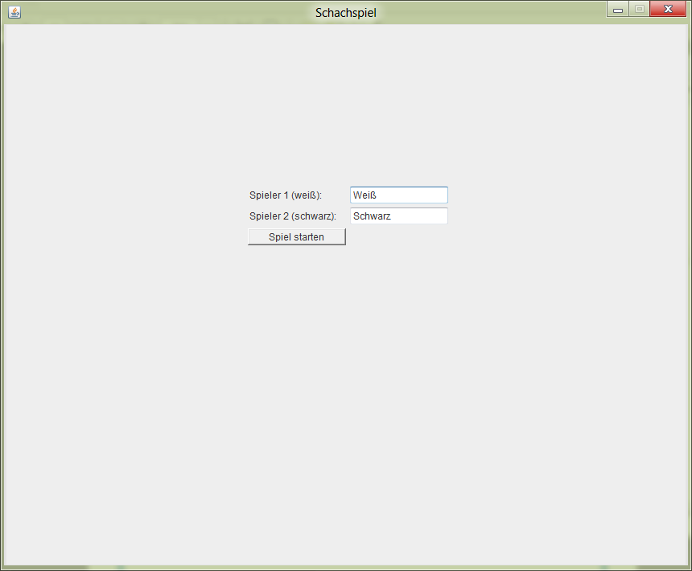
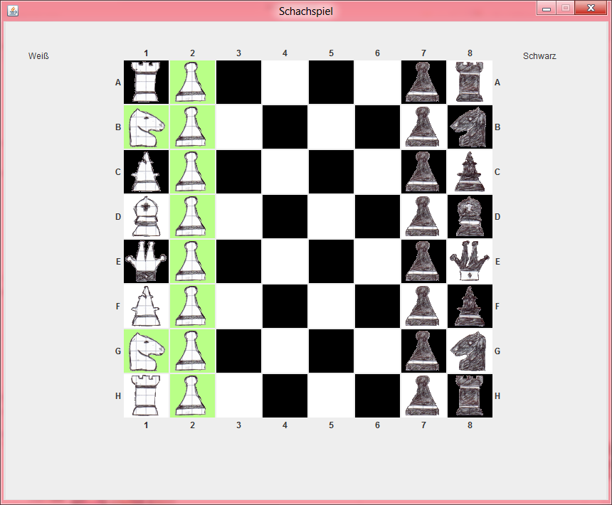

# Intensive course project - Chess game

<a href="https://gitlab.com/philipp.schweig/IntensiveCourseProject2012-ChessGame">
 GitLab repository (official)
<a/>
|
<a href="https://github.com/philippschweig/IntensiveCourseProject2012-ChessGame">
 GitHub repository (mirror)
<a/>
  

This is the source of the intensive course project of computer science lessons from the high school graduation year in 2012.

## Screenshots

 

